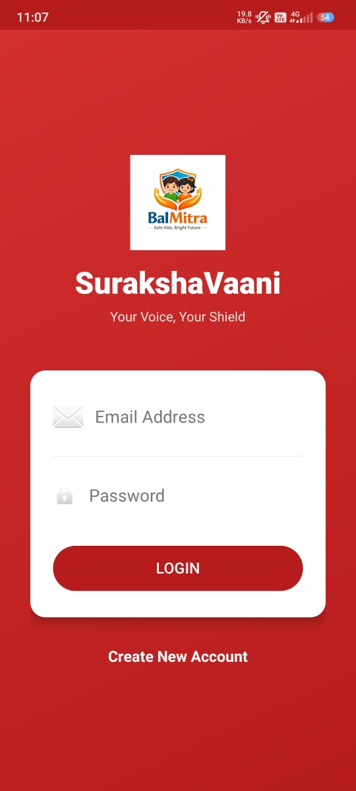
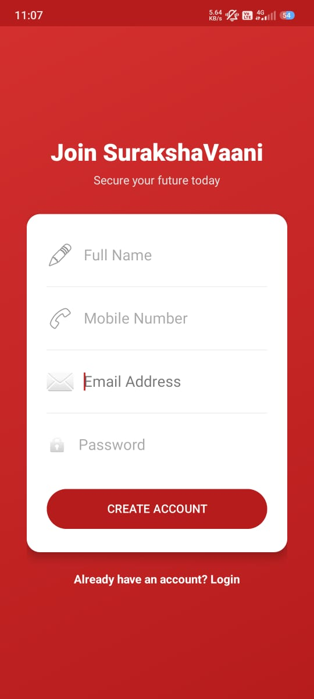
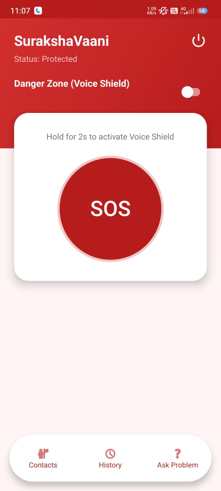
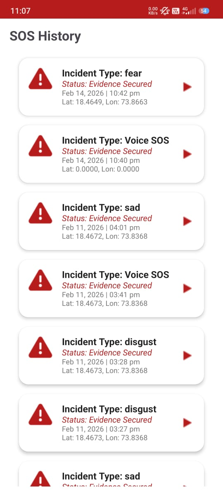
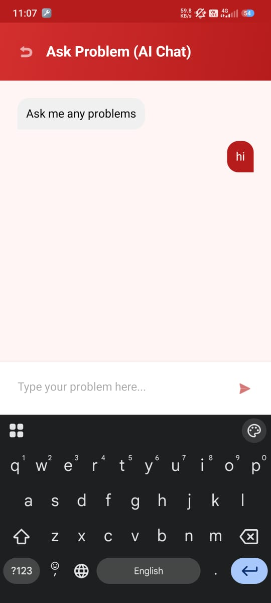

# 🛡️ SurakshaVaani — Your Voice, Your Shield

> **SurakshaVaani** (*"Suraksha"* = Protection, *"Vaani"* = Voice) is an AI-powered women & child safety application that uses real-time voice analysis and speech recognition to detect distress and trigger SOS alerts automatically.

---

## 📱 App UI Snapshots

<p align="center">
  
  
  
  
  
</p>

<p align="center">
  <b>Login</b> &nbsp;&nbsp;&nbsp;&nbsp;&nbsp;&nbsp;
  <b>Register</b> &nbsp;&nbsp;&nbsp;&nbsp;&nbsp;
  <b>SOS Home</b> &nbsp;&nbsp;&nbsp;&nbsp;
  <b>Incident History</b> &nbsp;&nbsp;
  <b>AI Chat</b>
</p>

---

## 🚀 Features

| Feature | Description |
|---------|-------------|
| 🎤 **Voice-Based SOS** | Hold the SOS button for 2s to activate Voice Shield — automatically records and analyzes audio |
| 🤖 **AI Emotion Detection** | Deep Learning CNN model detects fear, anger, distress from voice tone in real-time |
| 🗣️ **Keyword Detection** | Google Speech-to-Text scans for threat keywords: *"help"*, *"bachao"*, *"police"*, *"stop"* etc. |
| 📍 **GPS Location** | Every SOS alert captures GPS coordinates for emergency responders |
| 📂 **SOS History** | Full log of all incidents with emotion type, timestamp, and GPS location |
| 💬 **AI Chat** | Ask Problem (AI Chat) feature for guidance during or after an emergency |
| 👥 **Emergency Contacts** | Manage trusted contacts who receive instant SOS alerts |
| 🔒 **Evidence Secured** | Audio recordings are securely stored as evidence for each incident |

---

## 🧠 AI/ML System Architecture

```
Audio Input (Mic / Uploaded File)
        ↓
   ┌────────────────────────────────────┐
   │         Dual-Engine Analysis       │
   │  ┌──────────────┐  ┌───────────┐  │
   │  │ Tone Engine  │  │ Keyword   │  │
   │  │ (CNN Model)  │  │ Engine    │  │
   │  │              │  │ (STT API) │  │
   │  └──────┬───────┘  └─────┬─────┘  │
   └─────────┼────────────────┼────────┘
             ↓                ↓
   Acoustic Post-Processor + Decision Logic
             ↓
     SOS Triggered / Safe
```

### Model Details
- **Architecture**: Convolutional Neural Network (CNN) with BatchNormalization + Dropout
- **Input**: Log-Mel Spectrogram `(128 × 94 × 1)`
- **Output**: 8 emotion classes — `neutral`, `calm`, `happy`, `sad`, `angry`, `fear`, `disgust`, `surprise`
- **Dataset**: RAVDESS Speech Emotion Dataset
- **Post-Processor**: Rule-based Acoustic Corrector that improves Anger/Fear disambiguation by ~30-40%

---

## 🗂️ Project Structure

```
surakshavaani-main/
├── api/
│   └── main.py              # FastAPI backend — /analyze-threat endpoint
├── src/
│   ├── config.py            # Audio config, emotion mappings
│   ├── preprocessing.py     # Mel-spectrogram & feature extraction
│   ├── model.py             # CNN model architecture
│   └── emotion_corrector.py # Acoustic post-processing corrector
├── models/
│   └── surakshavaani_final.h5  # Trained model weights
├── assets/                  # UI screenshots
├── dashboard.py             # Streamlit operator dashboard
├── train.py                 # Model training script
├── create_dummy_model.py    # Generate placeholder model for testing
├── start.sh                 # One-command local launcher
└── requirements.txt         # Python dependencies
```

---

## ⚙️ Local Setup & Deployment

### Prerequisites
- Python 3.11
- macOS / Linux

### 1. Clone the repository
```bash
git clone https://github.com/yourusername/surakshavaani.git
cd surakshavaani-main
```

### 2. Create virtual environment & install dependencies
```bash
python3.11 -m venv venv
venv/bin/pip install -r requirements.txt
```

### 3. Generate model (if no trained model exists)
```bash
venv/bin/python create_dummy_model.py
```

### 4. Launch all services (one command)
```bash
bash start.sh
```

### 5. Open in browser
| Service | URL |
|---------|-----|
| 🖥️ Operator Dashboard | http://localhost:8501 |
| 📡 REST API | http://localhost:8000 |
| 📖 API Docs (Swagger) | http://localhost:8000/docs |

---

## 🔌 API Reference

### `POST /analyze-threat`
Upload an audio file for dual-engine threat analysis.

**Request:** `multipart/form-data` with `file` field (`.wav`, `.mp3`, `.m4a`, `.ogg`)

**Response:**
```json
{
  "sos_activated": true,
  "reasons": ["Detected distress emotion: Fear", "Threat Keyword Detected: 'help me'"],
  "transcription": "help me please",
  "tone_analysis": {
    "emotion": "fear",
    "confidence": 0.82
  }
}
```

---

## 🎯 SOS Trigger Logic

An SOS alert is activated if **any** of these conditions are met:

1. 🎭 **Emotion** is `fear`, `angry`, or `disgust` with confidence > 50%
2. 📢 **High volume scream** detected alongside distress emotion
3. 🔑 **Threat keyword** found in speech transcription

---

## 🚀 Training Your Own Model

1. Download the [RAVDESS dataset](https://zenodo.org/record/1188976)
2. Place files in `data/raw_audio/ravdess/Actor_*/`
3. Run training:
```bash
venv/bin/python train.py
```
Training takes ~30-60 minutes. The best model is auto-saved to `models/surakshavaani_final.h5`.

---

## 🛠️ Tech Stack

| Layer | Technology |
|-------|-----------|
| Mobile App | Android (Java/Kotlin) |
| AI Backend | FastAPI + TensorFlow/Keras |
| Audio Processing | Librosa, PyDub, SoundFile |
| Speech-to-Text | Google Speech Recognition API |
| Operator Dashboard | Streamlit |
| ML Model | CNN (Convolutional Neural Network) |
| Dataset | RAVDESS Speech Emotion |

---

## 📄 License

This project is developed for social good — women's and children's safety.  
© 2026 SurakshaVaani Team. All rights reserved.

---

<p align="center">
  <b>🛡️ SurakshaVaani — Your Voice, Your Shield 🛡️</b><br/>
  <i>Powered by Advanced AI • Real-time Threat Detection • Evidence Secured</i>
</p>
